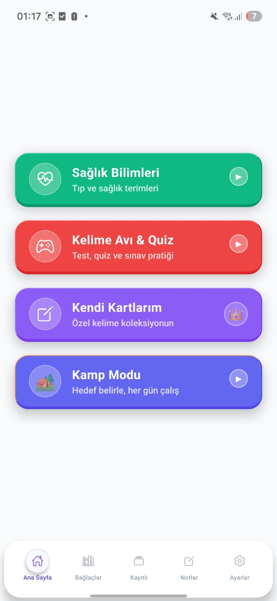
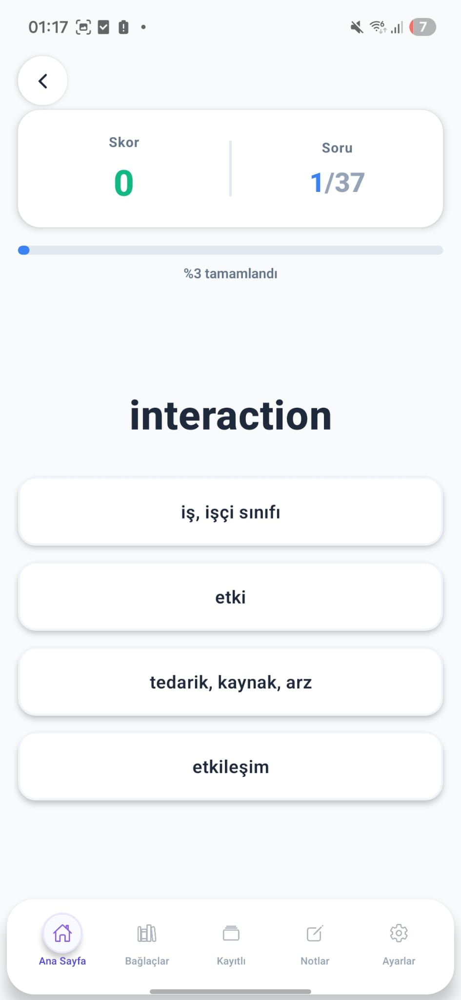
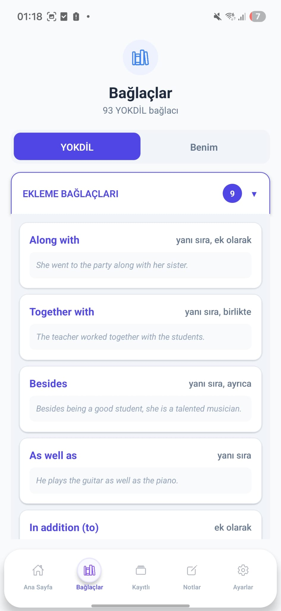
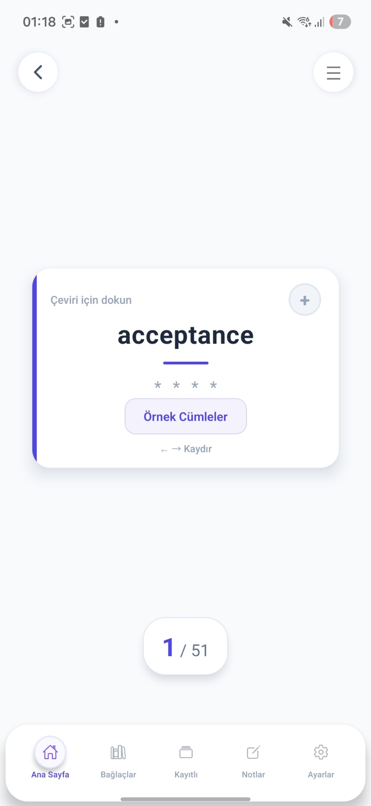

# 📚 Çıkmış Kelimeler — YÖKDİL / YDS Exam Prep App

A mobile exam-prep app for Turkey's **YÖKDİL / YDS** English exams: past-exam vocabulary by field & year, conjunctions, quizzes, flashcards and a daily study mode — built with **React Native**.

**📲 Live on Google Play:** https://play.google.com/store/apps/details?id=com.yokdilappnew

---

## ✨ Features
- 📖 **Past-exam vocabulary** grouped by field (Health, Social, Science…) and by year (600+ words per field)
- 🃏 **Flashcards** — tap to translate, example sentences, swipe to browse
- 🎮 **Word Hunt & Quiz** — test/quiz practice with scoring and progress
- 🔗 **Conjunctions (Bağlaçlar)** — 90+ YÖKDİL conjunctions with meanings and example sentences
- 📝 **My Cards** — build your own custom word collection
- ⛺ **Camp Mode** — set a daily goal and study every day
- 🌙 Offline study, dark mode, personal notes

## 🖼️ Screenshots
| Home | Quiz | Conjunctions | Flashcard |
|:---:|:---:|:---:|:---:|
|  |  |  |  |

## 🛠️ Tech Stack
**React Native · TypeScript** · offline word database (1,000+ entries) · HTML-to-PDF export · in-app purchases (IAP) · AdMob · push notifications

## 🔒 Notes
Signing keys/keystores and AdMob unit IDs are **not** included in this repository.

---
*Developer: [Hasan Mertkan Fırlar](https://github.com/MertkanFirlar) — designed and shipped end-to-end.*
